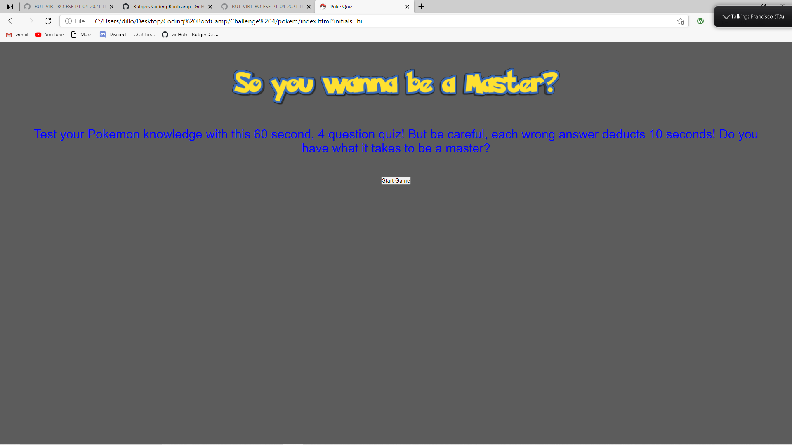
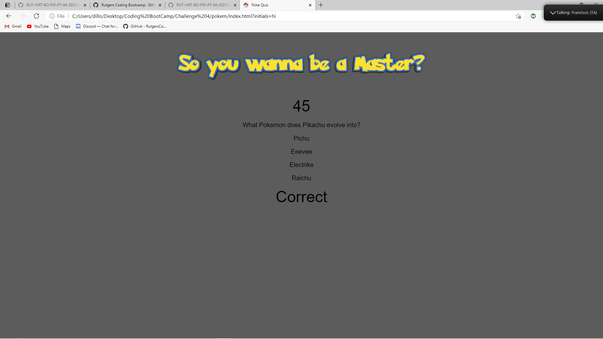
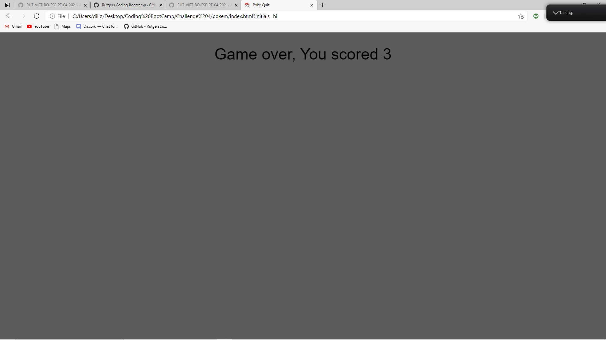

# pokem

The goal of this challenge was to create a quiz using javascript. There should be a "splash page" at the beginning with a start button. Once the start button is clicked a timer for 60 seconds begins and questions appear. If you select the incorrect answer, 10 seconds is deducted from the timer. If you select the correct answer, you get 1 point. At the end your points are tallied to give you a final score.

ScreenCaps:

live URL: https://dwalsh93.github.io/pokem/
